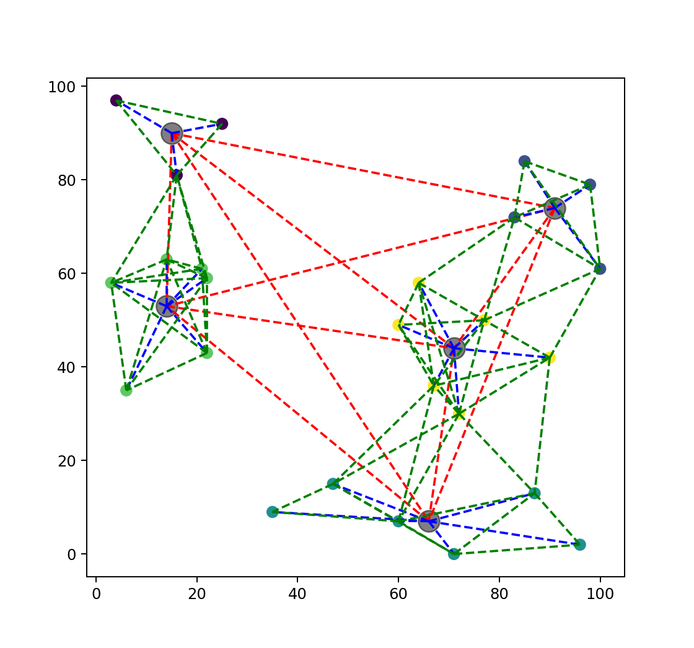

# Project 2 - Logistics Simulator

在这个项目中，我们将利用我们在课堂上学到的数据结构和算法来模拟一个（简化的）配送公司的物流系统。

## Evaluation

这是一个**小组**项目，每组有 **4 名学生**。

每个小组需要提交项目的实现（源代码、配置文件、测试用例、项目报告或用户手册等），并在W16上进行小组演示。

### Score Breakdown

本项目总分为**25 分**。评估分为 3 个部分：

- 由指导教师根据项目的设计和实现情况对整体质量进行评估（15 分）；
- 指导教师对演示质量的评价（5 分）；
  同学互评（5 分）。

### Peer evaluation

在第三部分的评分中，每位学生将对其他 7 个项目进行评分。然后计算出项目的平均分并进行排名。

- 排名第 1 和第 2 的小组获得 20 分（5\*4）
- 第 3-4 的小组获得 18 分（4.5\*4）
- 第 5-6 的小组获得 16 分（4\*4）
- 第 7-8 的小组获得 14 分（3.5\*4）。

然后，<u>小组成员将根据小组内的贡献决定每个小组成员的总分分配</u>。

例如，假设 A 组从第 1 部分获得 13 分，从第 2 部分获得 4 分，在第 3 部分中排名第 3，获得 18 分，并共同决定第 3 部分的分数分布为"[5, 5, 5, 3]"，那么他们在项目 2 中的成绩将是： A 组从第 1 部分获得 13 分，从第 2 部分获得 4 分，在第 3 部分中排名第 3，获得 18 分：

| Group A | Part1 | Part2 | Part3 | Project 2 grade |
| - | - | - | - | - |
| Member 1 | 13 | 4 | 5 | 22 |
| Member 2 | 13 | 4 | 5 | 22 |
| Member 3 | 13 | 4 | 5 | 22 |
| Member 4 | 13 | 4 | 3 | 20 |

## Getting Started

在本项目中，我们将首先实现一个简单的物流系统模拟器。之后，我们将对模拟器进行扩展，加入更多功能。

### Definitions

#### Stations and Centers

我们的物流系统中有两种类型的地点： `Stations` and `Centers`.

- Stations 能收件投件，也可以用于中转
- Centers 只能用于中转。
- Stations 规模较小，中转能力较差
- Centers 规模较大，中转能力较强

`Stations` 是小型仓库，可以从客户那里接收和发送包裹。也就是说，站点可以是包裹的源/目的地。它们也可以用作转运站，但转运能力有限。

`Centers` 是大型仓库，只能用于转运包裹。它们既不是任何包裹的来源也不是目的地。它们的规模更大，转运能力更强。

对于每个位置，我们定义以下属性：

- `ID`：每个位置的唯一标识符。ID 由一个小写字母和一个正整数组成。
  - 对于站点，字母是 "s"；对于中心，字母是 "c"。
  - ID 的例子有 `s1`、`s2`、`c1`、`c2` 等。

- `Pos`：地理位置。它可用于计算两个位置之间的距离。
- `Throughput`: 该位置在一个时间刻度内可处理（传输）的最大包裹数（稍后讨论）。
- `Delay`: 在将每个包裹发送到下一个地点之前，在该地点转移包裹所需的时间刻度。
- `Cost`: 在该地点转移一个货包的（经济）成本。 

#### Routes

A `Route` 是两个位置之间的连接。它用于将包裹从一个地点运输到另一个地点。

There are several types of routes, 如果进一步设计需要，您还可以定义自己的`Route` 类型。

- `Road`: connection between two `stations`. 
- `Highway`: connection between a `station` and a `center`.
- `Airline`: connection between two `centers`.

不同类型的路由具有不同的 `Route`，但它们都具有以下共同属性：

- `Src` / `Dst`: the source and destination of the route.
- `Time`: the time needed to transport a package through this route.
- `Cost`: the (economic) cost of transporting a package through this route.

“Time”和“Cost”都是根据源和目的地之间的距离来计算的，

距离是根据“Src”和“Dst”的“Pos”来计算的。

#### Packages

“Package” 是需要从一个位置传递到另一个位置的对象。它具有以下属性：

- `ID`: a unique identifier (UUID) for each package, used to track the package.
- `TimeCreated`: the time when the package is placed into the buffer of the source location. It's a float value.
- `Src` / `Dst`: the source and destination of the package.
- `Category`: the express category of the package. 

在模拟器的基本版本中，我们只考虑两类包：“Standard”和“Express”。

- `Standard` 包裹的交付具有成本效益（成本最小化），但并不匆忙。
- `Express` 包裹会尽快送达（尽量缩短时间），但成本较高。

#### Time Ticks

为了简化实现过程，模拟器基于离散事件模拟模型。时间被划分为离散的时间刻度。默认情况下，一个时间刻度代表 1 小时。

在进一步的设计中，您还可以使用事件驱动模型来优化模拟器。

### An Example of Map

In the following figure, we show an example of a map with 

- 25 stations (points) 
- 5 centers (circles). 

As you can see, 

- red lines are airlines, 
- blue lines are highways 
- green lines are roads.

在项目文件夹中，我们还提供了一个数据生成器脚本和本说明作为示例，该脚本可以生成 stations, centers, routes and packages randomly. 

您可以使用该数据生成器生成自己的测试数据。如需进一步实施，您还可以修改或设计自己的数据生成器。

## Basic Requirements - Simple Simulation

### Input

The simulator will take the following inputs:

- A list of stations and centers, with their properties
  - `ID: string "{'s' or 'c'}{int[0-n]}"`
  - `Pos: (int[0-100], int[0-100])`
  - `Throughput: int`
  - `Delay: int`
  - `Cost: float`
- A list of routes, with their properties
  - `Src: string`
  - `Dst: string`
  - `Time: float`
  - `Cost: float`
- A list of packages with properties:
  - `ID: string`
  - `TimeCreated: float`
  - `Src: string`
  - `Dst: string`
  - `Category: int[0-1]`

### Output

模拟结束后，作为一项基本要求，模拟器应能根据每个数据包的 ID 获取其跟踪信息。

跟踪信息应包括

  - `Src` / `Dst`
  - `TimeCreated`
  - `TimeDelivered`
  - `Log`

跟踪信息中，‘Log’是一个事件列表，每个事件包含以下信息：

- `Time`: the time of the event
- `Location`: the location of the event
- `Event`: the event type, which can be one of the following:
  - `ARRIVED`: the package is arrived at the location's buffer, waiting to be processed. A package starts it's trip from the source location with this event.
  - `PROCESSING`: the package finishes its waiting in the buffer, and starts to be processed
  - `SENT`: the package starts its trip to the next location. A package finishes its trip at the destination location with this event.

模拟器还应该能够输出通过给定位置的包裹列表，并按照到达该位置的顺序进行排序。

在进一步的实施过程中，您可能还需要根据自己的设计添加更多的统计数据和可视化功能。

### Simulation process

现在我们从包的角度来介绍一下模拟过程。

Consider a package with `ID=1`, `Src=s1`, `Dst=s2`, `Category=Express`, and `TimeCreated=5`.

这是一个“Express”套餐，因此模拟器将根据最短时间选择路线。请记住，一条路径的时间或金钱成本不仅是运输成本，还包括每个位置的处理成本。

> **重要提示：** 每个地点的等待时间都会根据排队状态不断变化（因为包裹的到达是随机的），所以一种简单的算法是根据创建包裹时系统的当前状态来选择和固定路线。(在进一步的实施中，您还可以考虑更先进的算法，可能是基于对系统状态的预测）。

Suppose the route from `s1` to `s2` minimizing the time cost is `s1 -> c1 -> s2`.

At `time=5`, the package is created at `s1`, and is placed into the buffer of `s1`. A log event is appended to the tracking information of the package, with `Time=5`, `Location=s1`, and `Event=ARRIVED`.

Suppose there are no other packages in the buffer of `s1`, and the package is immediately processed. A log event is appended to the tracking information of the package, with `Time=5`, `Location=s1`, and `Event=PROCESSING`.

The processing delay of `s1` is 2, so the package will start its trip to `c1` at time=7. A log event is appended to the tracking information of the package, with `Time=7`, `Location=s1`, and `Event=SENT`.

The time cost of the route from `s1` to `c1` is 3, so the package will arrive at the buffer of `c1` at time=10. A log event is appended to the tracking information of the package, with `Time=10`, `Location=c1`, and `Event=ARRIVED`. 

Supposing that there are 100 packages in the buffer of `c1` when the package is arrived, and the throughput of `c1` is 10. In this case the package will wait for 10 time ticks before being processed. At time=20, the package will start to be processed. A log event is appended to the tracking information of the package, with `Time=20`, `Location=c1`, and `Event=PROCESSING`.

The processing delay of `c1` is 1, so the package will continue its trip to `s2` at time=21. A log event is appended to the tracking information of the package, with `Time=21`, `Location=c1`, and `Event=SENT`.

The time cost of the route from `c1` to `s2` is 2, so the package will arrive at the buffer of `s2` at time=23. A log event is appended to the tracking information of the package, with `Time=23`, `Location=s2`, and `Event=ARRIVED`.

Supposing that there are no other packages in the buffer of `s2`, and the package is immediately processed. A log event is appended to the tracking information of the package, with `Time=23`, `Location=s2`, and `Event=PROCESSING`.

The processing delay of `s2` is 1, so the package will continue its trip at time=24. Since the destination is `s2`, the package is now considered delivered. A log event is appended to the tracking information of the package, with `Time=24`, `Location=s2`, and `Event=SENT`.

### Useful Data Structures and Algorithms

In order to implement the simulator, you will very possibly need to use the following data structures:

- `Graph`: a graph data structure to store the map of the logistics system.
- `Dictionary`/`Map`: to store the each package's tracking information according to its ID.
- `LinkedList`/`Stack`: to store the events of each package.
- `PriorityQueue`: to store the events of the simulation, and pop the event with the smallest time.

You will very likely to use the following algorithms:

- Shortest path algorithms: to calculate the optimal route for each package.
- Sorting algorithms: to sort the packages passed through a given location by the order they arrived at the location.

## Further Implementations

由于这是一个小组项目，而你的部分分数是基于全班同学的排名，因此我们鼓励你在基本实现的基础上设计并实现更有创意的功能。

以下是一些进一步实施的想法，我们鼓励你们提出自己的想法：

### Optimization of Simulation Algorithm

在基本实现中，我们假设仿真过程中的时间是离散的。您可以考虑采用事件驱动仿真算法来优化仿真效率，并更好地处理大规模仿真场景。在基本实现中，最佳路径是根据创建包裹时的递送网络状态确定的。您可以考虑实施更复杂的路径选择算法，例如基于对未来状态的预测，或在运输过程中动态调整路径，这可能有助于提高系统性能，例如包裹的及时性。

### Simulation of Extreme Scenarios

在双十一或黑色星期五购物节等极端情况下，一些站点会有大量订单需要发送，这可能会导致中转站或线路超负荷运转。在这种情况下，有时看似遥远的路线可能是更快的选择。您可以设计一些极端情况，测试系统在这些情况下的性能，并直观地显示转运站和路线的负载状态。然后，您可以根据模拟结果继续优化系统策略。

### Optimization of Transportation Strategy

在当前的基本实现中，特快数据包和标准数据包在缓冲区排队时待遇相同。事实上，特快数据包的优先级应该更高。但是，如果我们总是优先处理特快包裹，标准包裹可能永远不会被处理。您可以设计一些运输策略，在极端情况下优化系统，并比较这样做对包裹及时性和其他系统性能指标的影响。

### Optimization of Pricing Strategy

在目前的基本实施方案中，路线的运输时间和价格是固定的。但实际上，路线的运输能力和价格应该是动态变化的。当运输少量包裹时，每个包裹的运输成本可能会增加；当运输大量包裹时，线路的运输能力可能会受到限制，运输过程可能会出现拥堵，运输前的准备阶段也可能会花费更多时间。通过动态调整路线的运输能力限制、运输时间和价格，可以更真实地模拟物流公司在不同条件下的运输成本。在此基础上，您可以计算包裹的平均成本，制定一系列固定或动态定价策略，模拟物流公司的盈利能力，并考虑实施更复杂的运输策略，如等待包裹装满整车后再发货，或在路线拥堵时选择负载平衡策略，以优化您所实施的运输系统的关键指标。

## Submission and Presentation

Please submit your project as a zip file. Each group needs to submit these following contents:

- Source code of the project (in the programming language you like)
- Configuration files (e.g. modified data generator, etc.)
- Test cases (e.g. mentioned in the presentation, or you think is interesting to show)
- Project report or user manual (to explain the design and implementation of your project)
- Slides and other materials for the presentation
- Any other materials you think are necessary

And give a group presentation of no more than 8 minutes on W16. You can use slides or other materials to help your presentation. 

After the presentation, you might be asked some questions by the instructors or classmates. 

## Contact us

If you have any questions about the project, or you need some hints, please don't hesitate to contact TA, either by e-mail or on WeChat.

WeChat: oreste-maplewithered

E-mail: wangsj2000@sjtu.edu.cn
