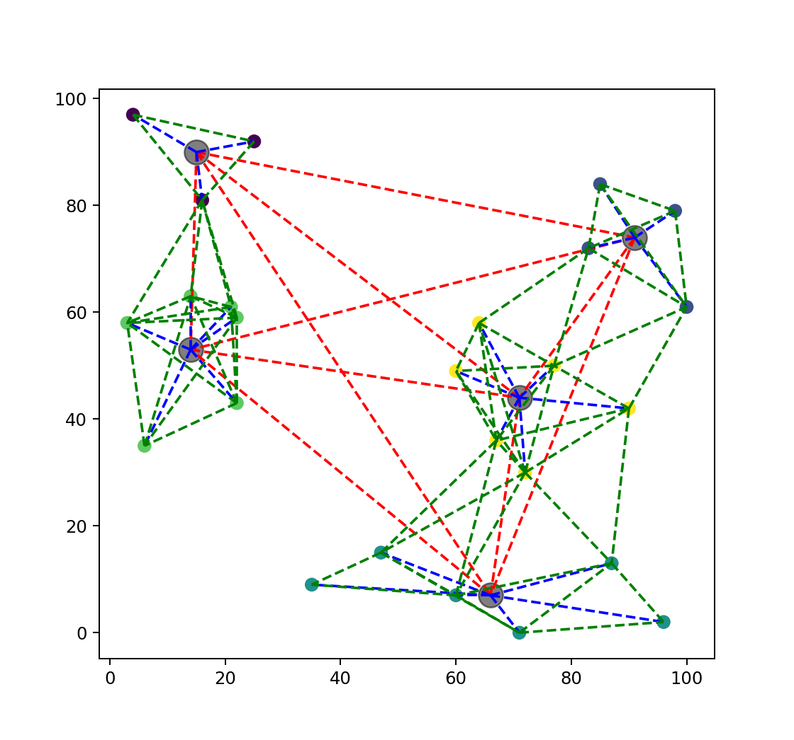

# Project 2 - Logistics Simulator

In this project, we will make use of the data structures and algorithms we have learned in class to simulate a (simplified) logistics system of a delivery company. 

## Evaluation

This is a **GROUP** project, with **4 students** per group. 

Each group needs to submit the implementation of project (source code, configuration files, test cases, project report or user manual, etc.), and give a group presentation on W16. 

### Score Breakdown

A total of **25 points** is assigned to this project. The evaluation is divided into 3 parts:

1.	Overall quality based on the design and realization of the project evaluated by instructors (15 pts);
2.	Presentation quality evaluated by instructors (5 pts);
3.	Peer evaluation by classmates (5 pts). 

### Peer evaluation

For the 3rd part of the score, each student will grade the other 7 projects. And the average of the project will be computed and ranked. 

Groups ranked 1 and 2 get 20 pts (5\*4), Group 3-4 get 18 pts (4.5\*4), Group 5-6 get 16 pts (4\*4) and Group 7-8 get 14 pts (3.5\*4). 

Then, <u>the distribution of these total points to each group member will be decided by group members according to the contribution within the group</u>.

For example, supposing that Group A get 13 pts from part 1, 4 pts from part 2 and ranked 3rd of class in the part 3 getting 18 pts, and decide together the distribution of points of part 3 as `[5, 5, 5, 3]`, then their grade of project 2 will be:

| Group A | Part1 | Part2 | Part3 | Project 2 grade |
| - | - | - | - | - |
| Member 1 | 13 | 4 | 5 | 22 |
| Member 2 | 13 | 4 | 5 | 22 |
| Member 3 | 13 | 4 | 5 | 22 |
| Member 4 | 13 | 4 | 3 | 20 |

## Getting Started

In this project, we will first implement a simple simulator of a logistics system. After that, we will extend the simulator to include more features.

### Definitions

#### Stations and Centers

There are two types of locations in our logistics system: `Stations` and `Centers`.

<!-- Stations能收件投件，也可以用于中转，Centers只能用于中转。Stations规模较小，中转能力较差，Centers规模较大，中转能力较强。 -->

- `Stations` are small warehouses that can both receive and send packages from/to customers. That is to say, stations can be the source/destination of packages. They can also be used as transfer stations, but the transfer capacity is limited.
- `Centers` are large warehouses that can only be used to transfer packages. They are neither source nor destination of any package. They have a larger scale and stronger transfer capacity.

For each location, we define the following properties:

- `ID`: a unique identifier for each location. ID is composed of a single lowercase letter and a positive integer. For a station, the letter is 's'; for a center, the letter is 'c'. Examples of IDs are `s1`, `s2`, `c1`, `c2`, etc.
- `Pos`: the geographic location. It can be used to calculate the distance between two locations.
- `Throughput`: the maximum number of packages that can be processed (transferred) by this location during one time tick (to be discussed later). 
- `Delay`: the time ticks needed for transferring each package at this location before it is sent to the next location.
- `Cost`: the (economic) cost of transferring a package at this location. 

#### Routes

A `Route` is a connection between two locations. It is used to transport packages from one location to another.

There are several types of routes, and you can also define your own types of routes if your further design requires.

- `Road`: connection between two `stations`. 
- `Highway`: connection between a `station` and a `center`.
- `Airline`: connection between two `centers`.

Different types of routes have different properties, but they all have the following properties in common:

- `Src` / `Dst`: the source and destination of the route.
- `Time`: the time needed to transport a package through this route.
- `Cost`: the (economic) cost of transporting a package through this route.

Both `Time` and `Cost` are calculated with the distance between the source and destination, and the distance is calculated based on the `Pos` of `Src` and `Dst`.

#### Packages

A `Package` is an object that needs to be delivered from one location to another. It has the following properties:

- `ID`: a unique identifier (UUID) for each package, used to track the package.
- `TimeCreated`: the time when the package is placed into the buffer of the source location. It's a float value.
- `Src` / `Dst`: the source and destination of the package.
- `Category`: the express category of the package. 

In the basic version of the simulator, we only consider two categories of packages: `Standard` and `Express`. 

- `Standard` packages are delivered cost-effectively (with minimized cost), but not in a hurry.
- `Express` packages are delivered as soon as possible (with minimized time), but at a higher cost.

#### Time Ticks

In order to simplify the implementation, the simulator is based on a discrete-event simulation model. Time is divided into discrete time ticks. As a default value, a time tick represents 1 hour.

In your further design, you can also use an event-driven model to optimize your simulator.

### An Example of Map

In the following figure, we show an example of a map with 25 stations (points) and 5 centers (circles). 

As you can see, red lines are airlines, blue lines are highways and green lines are roads.

In the project folder, you are also given a data generator script along with this instruction as an example, which can generate stations, centers, routes and packages randomly. You can use this data generator to generate your own data for testing. For further implementations, you can also modify or design your own data generator.

## Basic Requirements - Simple Simulation

### Input

The simulator will take the following inputs:

- A list of stations and centers, with their properties
  - `ID: string "{'s' or 'c'}{int[0-n]}"`
  - `Pos: (int[0-100], int[0-100])`
  - `Throughput: int`
  - `Delay: int`
  - `Cost: float`
- A list of routes, with their properties
  - `Src: string`
  - `Dst: string`
  - `Time: float`
  - `Cost: float`
- A list of packages with properties:
  - `ID: string`
  - `TimeCreated: float`
  - `Src: string`
  - `Dst: string`
  - `Category: int[0-1]`

### Output

After the simulation, as a basic requirement, the simulator should be able to retrieved each packet's tracking information by its ID. 

The tracking information should include:

  - `Src` / `Dst`
  - `TimeCreated`
  - `TimeDelivered`
  - `Log`

In the tracking information, `Log` is a list of events, each event contains the following information:

- `Time`: the time of the event
- `Location`: the location of the event
- `Event`: the event type, which can be one of the following:
  - `ARRIVED`: the package is arrived at the location's buffer, waiting to be processed. A package starts it's trip from the source location with this event.
  - `PROCESSING`: the package finishes its waiting in the buffer, and starts to be processed
  - `SENT`: the package starts its trip to the next location. A package finishes its trip at the destination location with this event.

The simulator should also be able to output the list of the packages passed through a given location, sorted by the order they arrived at the location.

In further implementations, you might also need to add more statistics and visualization according to your design. 

### Simulation process

Now we introduce the simulation process from a package's perspective.

Consider a package with `ID=1`, `Src=s1`, `Dst=s2`, `Category=Express`, and `TimeCreated=5`.

It's a `Express` package, so the simulator will choose the route based on minimized time. Remember that the time or money cost by a path is not only the cost of transportation, but also the cost of processing at each location.

> **Important notice:** the waiting time at each location keeps changing all the time according to the queueing status (since the arrival of packages is random), so a naive and simple algorithm is to choose and fix the route based on the current status of the system at the time when the package is created. (In further implementations, you can also consider more advanced algorithms, possibly based on the prediction of the system status.)

Suppose the route from `s1` to `s2` minimizing the time cost is `s1 -> c1 -> s2`.

At `time=5`, the package is created at `s1`, and is placed into the buffer of `s1`. A log event is appended to the tracking information of the package, with `Time=5`, `Location=s1`, and `Event=ARRIVED`.

Suppose there are no other packages in the buffer of `s1`, and the package is immediately processed. A log event is appended to the tracking information of the package, with `Time=5`, `Location=s1`, and `Event=PROCESSING`.

The processing delay of `s1` is 2, so the package will start its trip to `c1` at time=7. A log event is appended to the tracking information of the package, with `Time=7`, `Location=s1`, and `Event=SENT`.

The time cost of the route from `s1` to `c1` is 3, so the package will arrive at the buffer of `c1` at time=10. A log event is appended to the tracking information of the package, with `Time=10`, `Location=c1`, and `Event=ARRIVED`. 

Supposing that there are 100 packages in the buffer of `c1` when the package is arrived, and the throughput of `c1` is 10. In this case the package will wait for 10 time ticks before being processed. At time=20, the package will start to be processed. A log event is appended to the tracking information of the package, with `Time=20`, `Location=c1`, and `Event=PROCESSING`.

The processing delay of `c1` is 1, so the package will continue its trip to `s2` at time=21. A log event is appended to the tracking information of the package, with `Time=21`, `Location=c1`, and `Event=SENT`.

The time cost of the route from `c1` to `s2` is 2, so the package will arrive at the buffer of `s2` at time=23. A log event is appended to the tracking information of the package, with `Time=23`, `Location=s2`, and `Event=ARRIVED`.

Supposing that there are no other packages in the buffer of `s2`, and the package is immediately processed. A log event is appended to the tracking information of the package, with `Time=23`, `Location=s2`, and `Event=PROCESSING`.

The processing delay of `s2` is 1, so the package will continue its trip at time=24. Since the destination is `s2`, the package is now considered delivered. A log event is appended to the tracking information of the package, with `Time=24`, `Location=s2`, and `Event=SENT`.

### Useful Data Structures and Algorithms

In order to implement the simulator, you will very possibly need to use the following data structures:

- `Graph`: a graph data structure to store the map of the logistics system.
- `Dictionary`/`Map`: to store the each package's tracking information according to its ID.
- `LinkedList`/`Stack`: to store the events of each package.
- `PriorityQueue`: to store the events of the simulation, and pop the event with the smallest time.

You will very likely to use the following algorithms:

- Shortest path algorithms: to calculate the optimal route for each package.
- Sorting algorithms: to sort the packages passed through a given location by the order they arrived at the location.

## Further Implementations

Since this is a group project, and a part of your score is based on the ranking of the class, you are encouraged to design and implement more creative features based on the basic implementation. 

Here are some ideas for further implementations, and you are encouraged to come up with your own ideas:

### Optimization of Simulation Algorithm

In the basic implementation, we assume that the time during the simulation is discrete. You can consider implementing an event-driven simulation algorithm to optimize the simulation efficiency and better handle large-scale simulation scenarios. In the basic implementation, the optimal route is determined based on the status of the delivery network when the package is created. You can consider implementing more complex path selection algorithms, for example based on the prediction of future states, or dynamically adjusting the path during the transportation process, which may help improve your system's performance, such as package timeliness.

### Simulation of Extreme Scenarios

In extreme scenarios, such as on Double Eleven or Black Friday shopping festivals, some stations will have a large number of orders to be sent out, which may cause the transfer station or the route to be overloaded. In such cases, sometimes the seemingly distant route may be the faster choice. You can design some extreme scenarios to test the performance of your system in these scenarios and visualize the load status of transfer stations and routes. Then, you can continue to optimize your system's strategy based on the results of the simulation.

### Optimization of Transportation Strategy

In the current basic implementation, Express packages and Standard packages are treated equally when queuing in the buffer. In fact, Express packages should have higher priority. However, if we always prioritize the processing of Express packages, Standard packages may never be processed. You can design some transportation strategies to optimize your system in extreme scenarios and compare the impact of doing so on package timeliness and other system performance indicators.

### Optimization of Pricing Strategy

In the current basic implementation, the transportation time and price of routes are fixed. However, in reality, the transportation capacity and price of routes should be dynamically changing. When transporting a small number of packages, the transportation cost of each package may increase; when transporting a large number of packages, the transportation capacity of the route may be limited, the transportation process may be congested, and the preparation stage before transportation may also take more time. By dynamically adjusting the transportation capacity limit, transportation time, and price of routes, you can more realistically simulate the transportation costs of a logistics company under different conditions. Based on this implementation, you can calculate the average cost of packages, develop a series of fixed or dynamic pricing strategies, simulate the profitability of the logistics company, and consider implementing more complex transportation strategies, such as waiting for packages to fill the entire vehicle before shipping, or choosing load balancing strategies when routes are congested, to optimize key indicators of the transportation system you implemented.

## Submission and Presentation

Please submit your project as a zip file. Each group needs to submit these following contents:

- Source code of the project (in the programming language you like)
- Configuration files (e.g. modified data generator, etc.)
- Test cases (e.g. mentioned in the presentation, or you think is interesting to show)
- Project report or user manual (to explain the design and implementation of your project)
- Slides and other materials for the presentation
- Any other materials you think are necessary

And give a group presentation of no more than 8 minutes on W16. You can use slides or other materials to help your presentation. 

After the presentation, you might be asked some questions by the instructors or classmates. 

## Contact us

If you have any questions about the project, or you need some hints, please don't hesitate to contact TA, either by e-mail or on WeChat.

WeChat: oreste-maplewithered

E-mail: wangsj2000@sjtu.edu.cn
